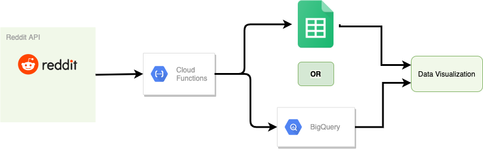

# stock-viz

### Architecture

### data collection:

1. collect the raw data from social media (posts, date, title, comments, upvote)
2. clean the title and extract symbols on certain conditions 
3. get the sentiment score  

### creating metrics
- count by range (hourly, daily, weekly and monthly) of top 10 or 20
- % change in 

This version of the Google Sheets API has a limit of 500 requests per 100 seconds per project, and 100 requests per 100 seconds per user. Limits for reads and writes are tracked separately.